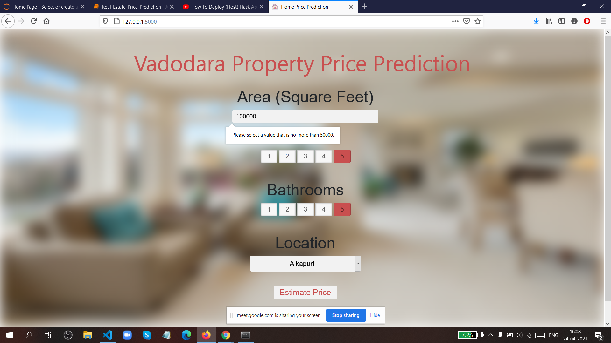

# Vadodara Real Estate Price Prediction WebApp
This Model/WebApp predicts real estate price in Vadodara. Many times we have come across websites like "Magicbricks.com" where they sell and estimate the price of the property in many part of the country, so this model is also inspired by the concept of predicting property prices based on the area, bedrooms, bathrooms and location. Firstly I built the model using sklearn and machine learning algorithm using Vadodara home prices dataset from kaggle.com. Second step was to write a python flask server that uses the saved model to serve http requests. Third component was the website built in html, css and javascript that allows user to enter home square ft area, bedrooms etc and it will call python flask server to retrieve the predicted price. During model building I came across all data science concepts such as data load and cleaning, outlier detection and removal, feature engineering, dimensionality reduction, gridsearchcv for hyperparameter tuning, k fold cross validation etc.

## Deployment:
This Web App is deployed to cloud (Heroku) where it can be accesssed. Running last command above will prompt that server is running on port 5000. 8. Now just load your cloud url in browser (for me it was ), website will open but it will not work unless I run this app's server in virtual OS Ubuntu.

Web App Link(Heroku) - https://real-estate-price-vadodara.herokuapp.com/ 

## Technologies used:
1. Python
2. Numpy and Pandas for data cleaning
3. Matplotlib for data visualization
4. Sklearn for model building
5. Jupyter notebook, visual studio code and pycharm as IDE
6. Python flask for http server
7. HTML/CSS/Javascript for UI
8. Heroku - for deploying the website
